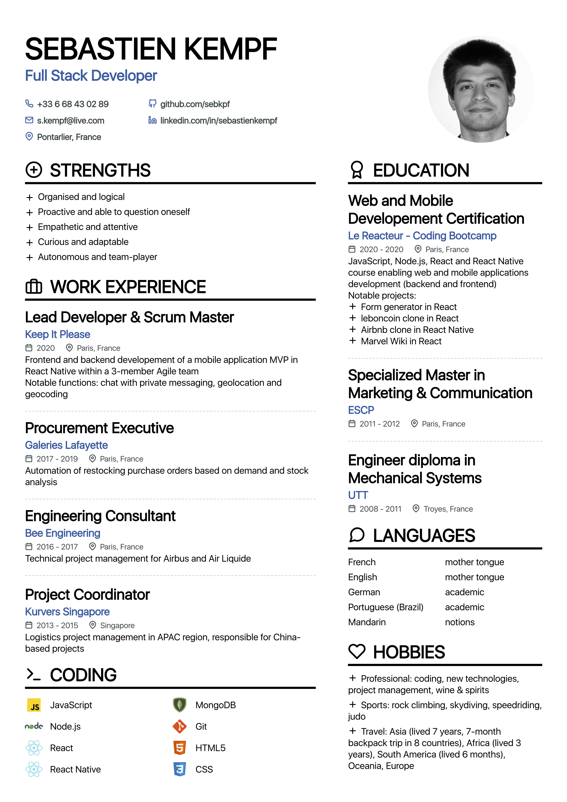

# Resume



<p align="center">
  Demo:<a href="https://sebkpf-cv.netlify.com/" target="_blank"> https://sebkpf-cv.netlify.com/</a>
</p>
<p align="center">
 This project was bootstrapped with <a href=https://github.com/facebook/create-react-app. target="_blank">Create React App</a>
</p>

## Overview

**Single page application**

- Language can be toggled when clicking on the avatar
- All info loaded from dataEng.js and dataFr located in ./src/assets/data/
- Resume can be updated and adapted directly in dataEng and dataFr.js models

**UI**

- Homemade UI without framework

### Running the project

Clone this repository :

```
git clone https://github.com/sebkpf/my-resume-react.git
cd my-resume-react
```

Install packages :

```
npm install
```

When installation is complete, run with:

```bash
npm start
```

## Deployment

- Client deployed with Netlify

## Contact

<a href="https://www.linkedin.com/in/sebastienkempf/" target="_blank">My LinkedIn profile</a>
